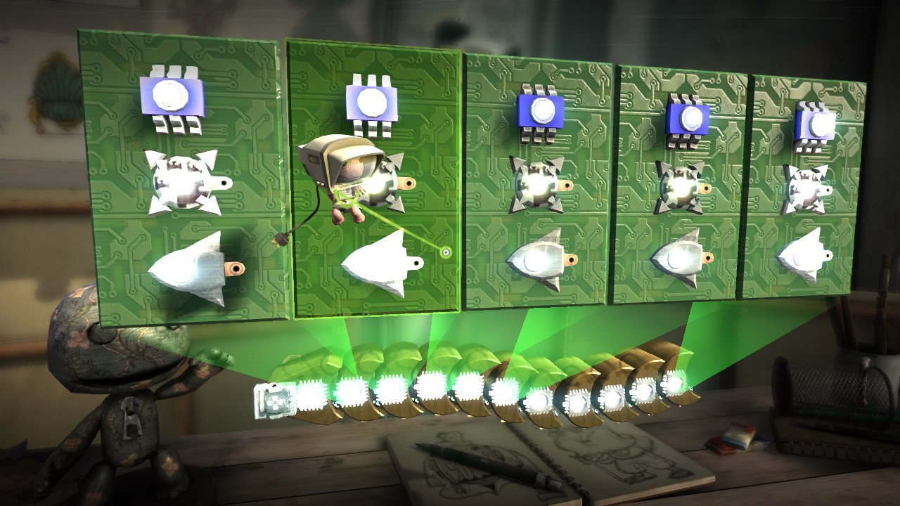

First of all, I hope to use my education in computer science to improve the lives of as many people as possible. I've seen the value in giving back to the community and I know the impact computer science can have. Software engineering is a tool that I plan to use often to improve as many sectors of industry as possible. Whether it be in education, health, research, or even gaming, I want to be able to better the world we live in.

Currently, I am most interested in pursuing something entertaining. Gaming has always been a hobby of mine and now I have the opportunity to make it a career. As a child, I remember losing hours upon hours to various games as a means to entertain and teach myself. What often goes overlooked in these games is the skills you need to learn in order to be successful. Running damage calculations, scheming new strategies, and learning new interactions are all beneficial to a growing child's mind. I hope to grow as an engineer and one day be able to create new experiences that inspire others.

In my free time, I enjoy the thought of pushing the limits of humanity. In the field of computer science, there are always emerging sectors of interest. Most notably, I have been particularly interested in the rise of automation and artificial intelligence (AI) in the past few years. Automation seeks to cause social upheaval but also vastly improve our everyday lives. Concepts such as self-driving vehicles and quicker checkout lines are just the beginning and I would love to be apart of this revolution. Currently, I do not have the skills necessary to pursue such a concept, but I have been working towards the knowledge necessary by completing projects such as the Tensorflow machine learning application. In the future, I hope to contribute in some form to autonomy and a general purpose learning AI.
