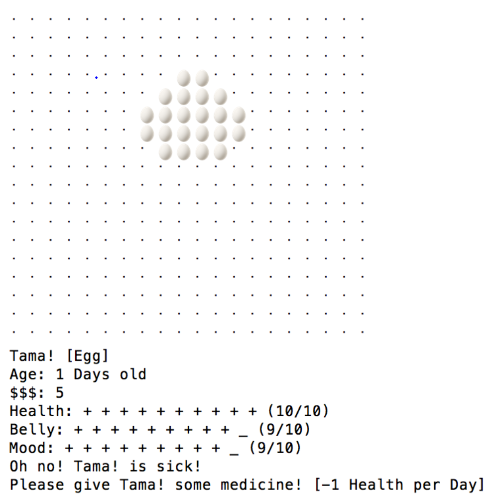
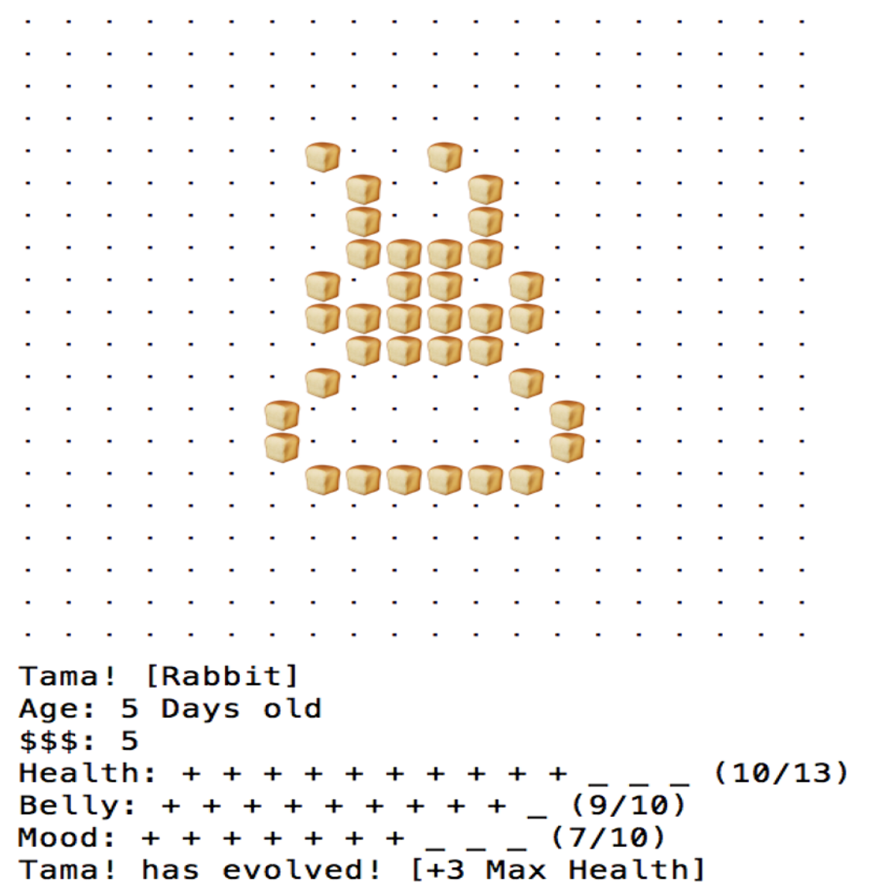
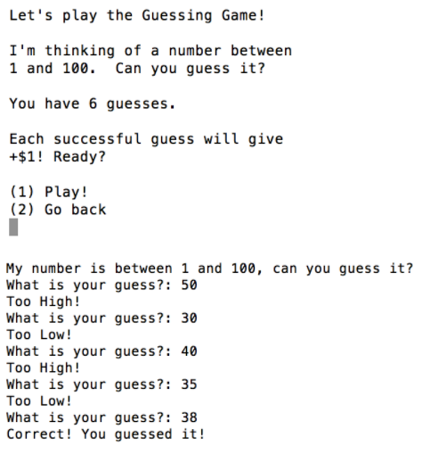

  
  
  

This project was a Final Project for our course in Object Oriented Programming, EE 205. This game follows the player as they try to care for a digital pet known as a tamagotchi. The tamagotchi has stats that the player must maintain in order for the tamagotchi to evolve into new stages and therefore progress through its life cycle.

We began with the idea of displaying the tamagotchi as a series of sprites that would change as the tamagotchi evolved. We began by implementing the tamagotchi as a series of sprites so we could show an “animation” by quickly changing between two sprites and clearing the screen. This required us to use a wait function and system commands to manipulate the display.
After working on the display, we turned to implementing the driver and tamagotchi class. The driver would simply consist of menus of choices that would then call functions of the tamagotchi class. The driver currently has 6 input options: Feed Tamagotchi, Play a Game, Go to the Shop, Check Inventory, Check Status, and Next Day. The descriptions of each of the menu options can be found in the instructions above. All of these commands are run within a while loop that checks the state of the tamagotchi on each iteration.  If the tamagotchi is found to be dead, the game will prompt the user and exit. If the tamagotchi is found to be ready to evolve, an animation will play and the user will be notified that the tamagotchi has evolved. An evolution causes the sprite displayed to change to the next evolution. The evolutions are as follows, egg, rabbit, potato.

In order to give the players a side objective, we create a couple minigames to earn cash. For the games, we split them into two different files. Both games utilize text files as instructions to print when the user selects a game. This is done by creating a filestream using ifstream and then piping the contents of the text file to the std I/O stream. For the memory game, the given string is first generated by the rand() function. The rand() function returns integers between 60 and 95 which we then, by ASCII conversion, convert into a string. The user then enters a string that we compare to the original string. For the guessing game, we use rand() to generate a random number between 1 and 100 and then ask for the user’s guess. We then loop until the user is out of guesses or the user guesses the correct number.

You can view the source code on [Github](https://github.com/kekupua/WDK-Homework/tree/master/Final%20Project).
