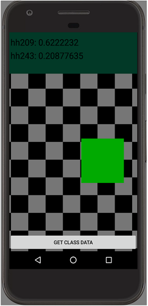

  
  

Rooms is an Android application built to help students and teachers learn the availability of rooms around the University of Hawaii at Manoa campus. By using the image recognition neural network, Rooms returns a confidence rating for what it believes the rooms is and data about the room. The data returned contains the schedule of registered classes from the [UH Website](https://www.sis.hawaii.edu/uhdad/avail.classes?i=MAN).

For this application, I initially designed and researched the topic of machine learning and came across the Tensorflow library. The Tensorflow library is an open-source software library for machine learning that is built and maintained by Google.  After reading more into and practicing Tensorflow syntax, I decided to use Tensorflow as an image recognition tool. My partner collected the raw data which included videos of the rooms to be identified. Then, using ffmpeg, I split the videos into individual frames to be used for training our Inceptionv3 data model. The model is trained on large amounts of images to recognize and categorize new images. After that, we modified the source code for image recognition to support our new categories and provide information about the classrooms from our database. My partner generated the database and connected it to the application. I built the interface for linking the data tied to each room. Once that was completed, I sorted the data from the database and my partner designed the layout for the new activity.

Building Rooms was an interesting endeavor as a lot of the functionality was obfuscated from us. The tensorflow library is quite extensive and learning all of it would've take a substantial amount of time for us. Instead, we decided to use Google's example source code as a launch pad for our application. This instead allowed us to build a functional application on top of Google's source code. Therefore, we could spend more time learning Java and Android specifically instead of spending time learning a lot of the tensorflow library.   

Source: <a href="https://github.com/kekupua/EE396/tree/master/tensorflow-for-poets-2"><i class="large github icon"></i>Rooms</a>
