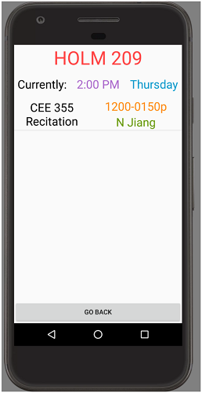

  
  

Rooms is an Android application built to help students and teachers learn the availability of rooms around the University of Hawaii at Manoa campus. By using the image recognition neural network, Rooms returns a confidence rating for what it believes the rooms is and data about the room. The data returned contains the schedule of registered classes from the [UH Website](https://www.sis.hawaii.edu/uhdad/avail.classes?i=MAN).

Source: <a href="https://github.com/kekupua/EE396/tree/master/tensorflow-for-poets-2"><i class="large github icon"></i>Rooms</a>
