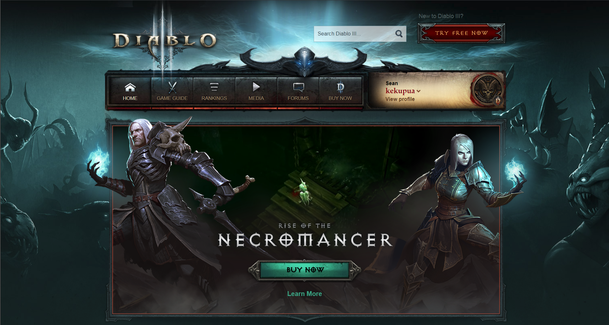

For the Summer of 2017, I was assigned to work on the Diablo III franchise website. This project had me working with a mentor who guided me as I completed tasks to support the launch of new content for Diablo III. During this time, Diablo III was in the process of releasing new game content in the form of Downloadable Content (DLC). My job was to create new web content to release alongside the new game content to drive sales and improve player retention. 

As a Front-end engineer, I was responsible for engineering new web content based on designs given to me by the team designers. This includes the new homepage header as seen above, Necromancer class page, Necromancer profile support, and various other updates for patch 2.6. The work on these pages are my own and was required to pass code reviews in order to be pushed to production. 

As an intern, I learned a lot from my mentor and my surrounding team. I improved my front-end engineering skills as I became engrossed in techniques such as the Agile/Scrum methodology, continuous integration, unit tests, code reviews, linting tools, task runners, and much more.   

Source: <a href="https://us.battle.net/d3/en/">Diablo III Website</a>

